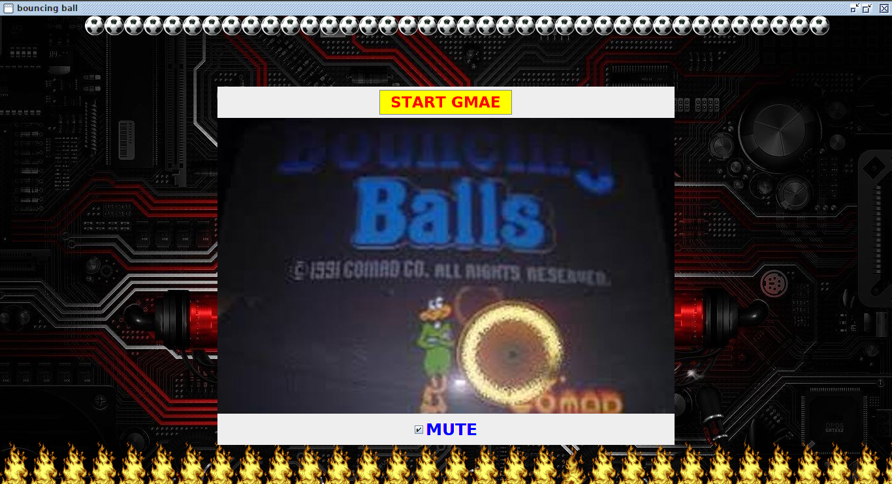
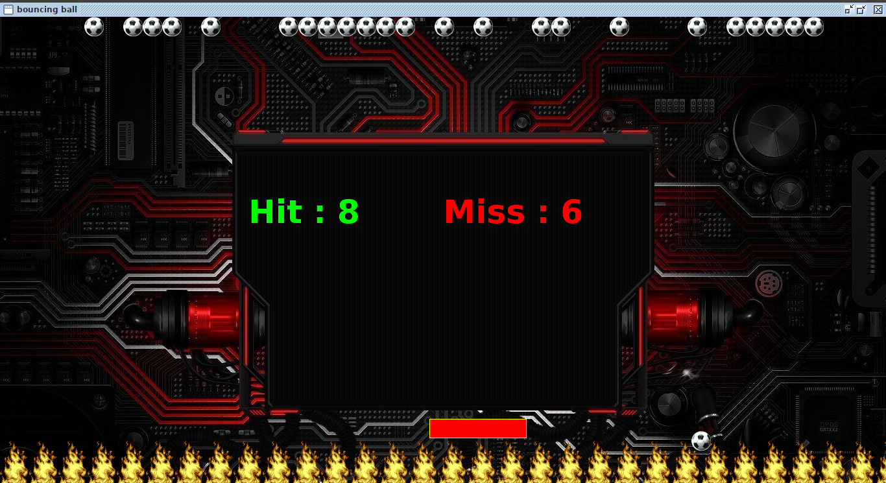

# Bounce-Ball

This is a one time Gaming Program

***






***
The bar will move corresponding to x-Position of Mouse change.

If you connect the falling Ball with the Bar , Its ***Hit*** otherwise  ***Miss***

To Run this, Compile and Run:

```Java
>javac CatchBall.java

>java CatchBall

```
